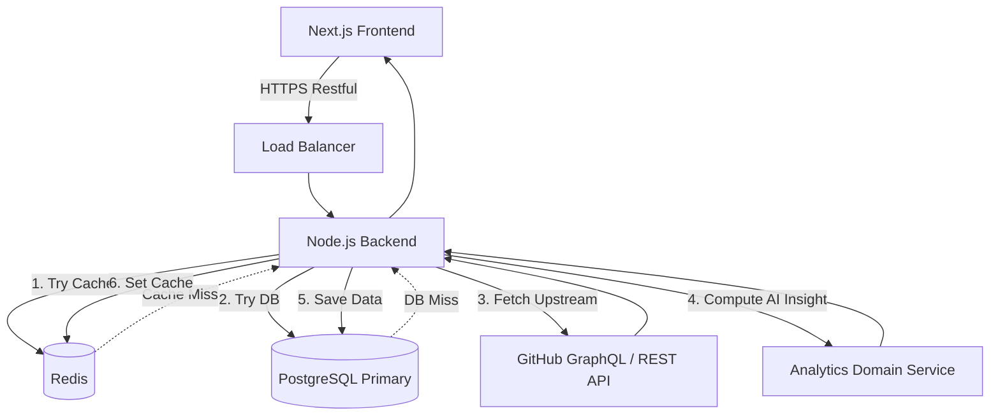

# System Architecture

## Overview

DevScope uses a decoupled, event-driven monolith architecture split into a Next.js frontend and an Express.js/Node backend. It uses a high-performance Redis caching layer to limit outbound calls to the GitHub API, reducing overall latency and bypass throttling.

## Component Flow Diagram

## Frontend Architecture
- **Next.js App Router**: Client and Server Components for optimal SEO and rapid initial paints.
- **State Management**: React Query combined with lightweight Context APIs for prop-drilling avoidance and local caching.
- **Styling**: Tailwind CSS + Shadcn UI primitive abstractions for consistency.

## Backend Architecture
- **Layers**: 
  - Controllers (Request/Response mapping)
  - Services (Business Logic & Analytics)
  - Modalities / Connectors (GitHub abstractions, Redis connection)
- **Database Modeler**: Prisma for type-safe database queries.

## Scalability Strategy
- **Horizontal Pod Autoscaling**: Backend containers are entirely stateless, holding no local sessions. Session state validates symmetrically via JWT. This allows arbitrary replication across cloud instances.
- **Connection Pooling**: PgBouncer or Prisma Accelerate configures a healthy pool to PostgreSQL to stop max-connection fatigue.
- **Analytics Queue**: Long-running computation regarding complex insights will be delegated to BullMQ via Redis.