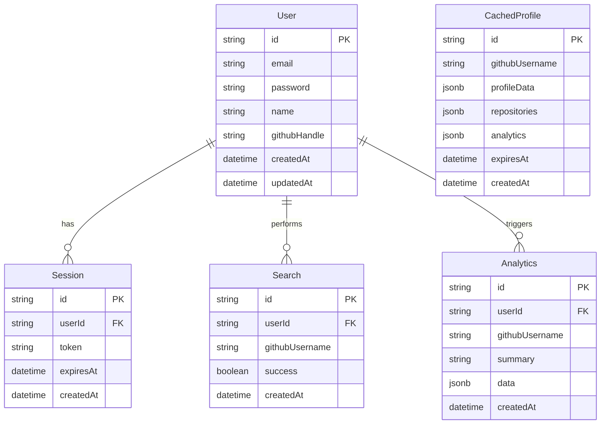

# Database Architecture

## ER Diagram

## Prisma Schema Explanation

The Prisma schema uses PostgreSQL as the underlying database. The `User` model stores authentication and user details. The `CachedProfile` stores GitHub API data directly in typed JSON fields to prevent frequent API calls and to bypass rate limits. `Search` logs user search queries for history playback, and `Analytics` stores AI-driven developer insights and calculated scores over time.

## Indexing Strategy

- **Primary Keys**: UUIDs are used for all PKs to allow distributed ID generation safely.
- **Foreign Keys**: `userId` is indexed on `Session`, `Search`, and `Analytics` to optimize join queries for user dashboard views.
- **Unique Constraints**: `email` and `githubUsername` on `User` are unique. `token` on `Session` is unique.
- **Search Optimization**: `githubUsername` on `CachedProfile` has a high-speed B-Tree index for quick profile fetch.

## Caching Strategy (Redis)

While `CachedProfile` serves as a long-term data persistence layer for GitHub profiles, Redis is used as an in-memory L1 cache.
- **TTL**: Profile queries are cached in Redis with a 10-minute TTL.
- **Cache-Aside Pattern**: Endpoints first attempt to fetch data from Redis, falling back to PostgreSQL, then to the GitHub API.

## Data Lifecycle

- Profiles older than 7 days are re-fetched from the GitHub API and updated in the DB upon user request.
- `Session` records are scrubbed periodically via a cron-job once `expiresAt` is reached.
- `Search` logs are bound to the user. If a user deletes their account, cascade delete cleans up all searches and sessions.