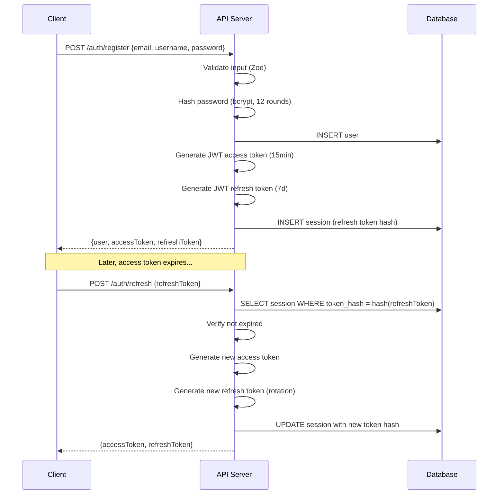
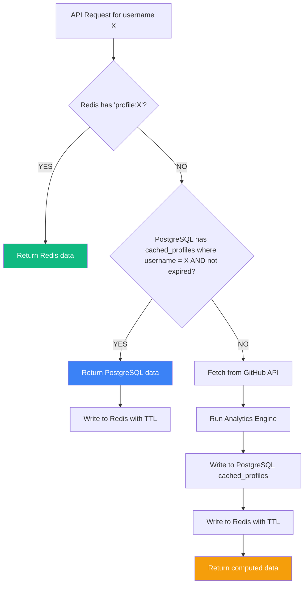

# ✨ Features Documentation

## DevScope — Complete Feature Reference

---

## Table of Contents

- [Feature Overview](#feature-overview)
- [1. GitHub Profile Search System](#1-github-profile-search-system)
- [2. Analytics & Intelligence Engine](#2-analytics--intelligence-engine)
- [3. Dashboard Visualizations](#3-dashboard-visualizations)
- [4. Authentication System](#4-authentication-system)
- [5. Multi-Tier Caching Strategy](#5-multi-tier-caching-strategy)
- [6. Search History Management](#6-search-history-management)
- [7. Theme System (Dark/Light)](#7-theme-system-darklight)
- [8. Charts & Data Visualization](#8-charts--data-visualization)
- [9. Error Handling & User Feedback](#9-error-handling--user-feedback)
- [10. Responsive Design](#10-responsive-design)
- [Future Features Roadmap](#future-features-roadmap)

---

## Feature Overview

| # | Feature | Status | Priority | Complexity |
|---|---------|--------|----------|------------|
| 1 | GitHub Profile Search | ✅ Core | P0 | Medium |
| 2 | Analytics & Intelligence Engine | ✅ Core | P0 | High |
| 3 | Dashboard Visualizations | ✅ Core | P0 | High |
| 4 | Authentication System | ✅ Core | P0 | Medium |
| 5 | Multi-Tier Caching | ✅ Core | P0 | High |
| 6 | Search History | ✅ Core | P0 | Low |
| 7 | Theme System | ✅ Core | P1 | Low |
| 8 | Charts & Data Viz | ✅ Core | P0 | Medium |
| 9 | Error Handling | ✅ Core | P0 | Medium |
| 10 | Responsive Design | ✅ Core | P1 | Medium |

---

## 1. GitHub Profile Search System

### Description
The search system is the primary entry point for all DevScope functionality. Users enter a GitHub username into a prominent search bar, and the system fetches, analyzes, and displays comprehensive developer analytics.

### User Experience

1. **Search Bar** — Prominently displayed at the top of the dashboard. Features a clean input field with a search icon and a submit button.
2. **Loading State** — After submission, a skeleton loader or spinner appears while data is fetched and computed.
3. **Results Display** — Analytics dashboard populates with the searched developer's data.
4. **Error State** — If the username doesn't exist or the API fails, a clear error message is displayed inline.

### Technical Implementation

```
User Input → Frontend Validation → API Request → Cache Check → GitHub Fetch → Analytics Compute → Response
```

**Frontend:**
- Input field with debounced validation (no special characters, 1-39 chars, GitHub username pattern)
- Form submission triggers `GET /api/github/user/:username/analytics`
- Loading skeleton components display during data fetch
- Error boundary catches and displays API errors

**Backend:**
- Route: `GET /api/github/user/:username/analytics`
- Controller validates the username parameter using Zod
- Service layer orchestrates: cache check → GitHub API fetch → analytics computation → cache storage
- Response follows the `ApiResponse<DeveloperAnalytics>` contract

### Validation Rules

| Rule | Pattern | Error Message |
|------|---------|---------------|
| Required | Non-empty string | "Username is required" |
| Length | 1-39 characters | "Username must be between 1 and 39 characters" |
| Pattern | `/^[a-zA-Z0-9](?:[a-zA-Z0-9]|-(?=[a-zA-Z0-9])){0,38}$/` | "Invalid GitHub username format" |
| No consecutive hyphens | No `--` | "Username cannot contain consecutive hyphens" |

### API Endpoints Used

| GitHub API Endpoint | Purpose | Cache TTL |
|--------------------|---------|-----------|
| `GET /users/:username` | Basic profile data | 1 hour |
| `GET /users/:username/repos?per_page=100&sort=pushed` | Repository list | 30 minutes |
| `GET /repos/:owner/:repo/languages` | Per-repo language bytes | 1 hour |
| `GET /users/:username/events?per_page=100` | Recent activity events | 10 minutes |

---

## 2. Analytics & Intelligence Engine

### Description
The analytics engine is DevScope's core value proposition. It takes raw GitHub data (profile, repositories, languages, events) and computes structured intelligence: five scoring dimensions, language distributions, skill assessments, repo health scores, and contribution trends.

### Scoring Dimensions

#### 2.1 Activity Score (0-100)
Measures how actively the developer uses GitHub.

**Inputs:**
- Number of recent events (last 90 days from Events API)
- Push event frequency
- Repository creation rate
- Event diversity (different event types)

**Calculation:**
```
activityScore = (
  (recentEvents / 300) * 30 +          // Event volume (max 300 from API)
  (pushEvents / totalEvents) * 25 +     // Push frequency ratio
  (reposCreatedLast6Mo / 5) * 20 +     // Recent repo creation (capped at 5)
  (uniqueEventTypes / 10) * 25          // Event type diversity
) → clamp(0, 100)
```

**Score Labels:**
| Score | Label |
|-------|-------|
| 90-100 | Exceptional |
| 75-89 | Very Active |
| 60-74 | Active |
| 40-59 | Moderate |
| 20-39 | Low |
| 0-19 | Minimal |

#### 2.2 Engagement Score (0-100)
Measures community interaction and influence.

**Inputs:**
- Follower count
- Total stars received across all repos
- Total forks received across all repos
- Follower-to-following ratio

**Calculation:**
```
engagementScore = (
  min(followers / 100, 1) * 30 +        // Followers (cap at 100 for max)
  min(totalStars / 50, 1) * 30 +         // Stars received
  min(totalForks / 20, 1) * 20 +         // Forks received
  min(followers / max(following, 1), 5) / 5 * 20  // Influence ratio
) → clamp(0, 100)
```

**Score Labels:**
| Score | Label |
|-------|-------|
| 90-100 | Community Leader |
| 75-89 | Highly Engaged |
| 60-74 | Engaged |
| 40-59 | Moderate |
| 20-39 | Emerging |
| 0-19 | Observer |

#### 2.3 Consistency Score (0-100)
Measures regularity and longevity of contributions.

**Inputs:**
- Account age (months since creation)
- Spread of events across recent months
- Ratio of active months to total account age
- Average days between pushes

**Calculation:**
```
consistencyScore = (
  min(accountAgeMonths / 36, 1) * 25 +  // Account longevity (3yr = max)
  (activeMonths / totalMonths) * 35 +    // Activity spread
  (1 - avgDaysBetweenPushes / 30) * 40  // Push regularity
) → clamp(0, 100)
```

#### 2.4 Quality Score (0-100)
Measures adherence to repository best practices.

**Inputs:**
- Average repo health score across all repos
- Percentage of repos with README
- Percentage of repos with license
- Percentage of repos with description
- Percentage of repos with topics/tags

**Calculation:**
```
qualityScore = averageRepoHealthScore
// Where each repo's health is computed from 9 criteria (see Repo Health below)
```

**Score Labels:**
| Score | Label |
|-------|-------|
| 90-100 | Exemplary |
| 75-89 | High Quality |
| 60-74 | Good |
| 40-59 | Average |
| 20-39 | Below Average |
| 0-19 | Needs Improvement |

#### 2.5 Overall Score (0-100)
A weighted composite of all four dimensions.

**Calculation:**
```
overallScore = (
  activityScore * 0.25 +
  engagementScore * 0.25 +
  consistencyScore * 0.25 +
  qualityScore * 0.25
) → round to integer
```

### Repository Health Score

Each repository is evaluated on 9 criteria:

| Criterion | Weight | Source |
|-----------|--------|--------|
| Has README | 15 | `has_wiki` or detected via naming convention |
| Has License | 15 | `license` field |
| Has Description | 10 | `description` field |
| Has Topics | 10 | `topics` array length > 0 |
| Has Homepage | 5 | `homepage` field |
| Is Active | 15 | `pushed_at` within last 6 months |
| Stars | 10 | `stargazers_count` (log-scaled) |
| Forks | 10 | `forks_count` (log-scaled) |
| Low Issues | 10 | `open_issues_count` (inverse, capped) |

### Language Distribution

**Process:**
1. Fetch all repos for the user
2. For each non-fork repo, fetch language bytes via `/repos/:owner/:repo/languages`
3. Aggregate bytes per language across all repos
4. Calculate percentage: `(language_bytes / total_bytes) * 100`
5. Assign color from the `LANGUAGE_COLORS` constant (matching GitHub's official colors)

**Output:** `LanguageDistribution[]` sorted by percentage descending.

### Skill Assessment

**Process:**
1. Collect all languages detected across repos
2. Collect all topics from repo metadata
3. Map each language to skills via `SKILL_MAPPING` constant
4. Map each topic to skills via `TOPIC_SKILL_MAPPING` constant
5. Deduplicate and score based on usage frequency
6. Categorize into: `language`, `framework`, `tool`, `domain`, `practice`

**Output:** `SkillScore[]` with skill name, score (0-100), and category.

### Contribution Trends

**Process:**
1. Parse events from the Events API
2. Group by date (ISO format)
3. Count commits, unique repos, and total events per date
4. Return as time-series data for charting

**Output:** `ContributionTrend[]` sorted by date ascending.

---

## 3. Dashboard Visualizations

### Layout Structure

The dashboard uses a tabbed or sectioned layout:

```
┌─────────────────────────────────────────────────────┐
│  Search Bar                                    [🌓] │
├─────────────────────────────────────────────────────┤
│                                                     │
│  ┌──────────┐  ┌────────────────────────────────┐   │
│  │  Avatar   │  │  Name, Bio, Location, Company  │   │
│  │  Image    │  │  Followers · Following · Repos  │   │
│  └──────────┘  └────────────────────────────────┘   │
│                                                     │
│  ┌─────┬─────┬─────┬─────┬─────┐                   │
│  │ Act │ Eng │ Con │ Qua │ All │  Score Cards      │
│  │ 72  │ 65  │ 88  │ 79  │ 76  │                   │
│  └─────┴─────┴─────┴─────┴─────┘                   │
│                                                     │
│  [Languages] [Repositories] [Skills] [Trends]       │
│  ┌─────────────────────────────────────────────┐    │
│  │                                             │    │
│  │        Active Tab Content Area              │    │
│  │        (Charts, Tables, Cards)              │    │
│  │                                             │    │
│  └─────────────────────────────────────────────┘    │
│                                                     │
│  ┌─────────────────────────────────────────────┐    │
│  │  Natural Language Summary                    │    │
│  │  "John is an active TypeScript developer..." │    │
│  └─────────────────────────────────────────────┘    │
└─────────────────────────────────────────────────────┘
```

### Dashboard Sections

| Section | Components | Data Source |
|---------|-----------|-------------|
| Profile Header | Avatar, name, bio, metadata, social links | `GitHubUser` |
| Score Overview | 5 animated score cards/gauges | `DeveloperScores` |
| Languages | Donut chart + language table | `LanguageDistribution[]` |
| Repositories | Sorted repo cards with health badges | `RepoHealthScore[]` / `TopRepo[]` |
| Skills | Radar chart + categorized skill list | `SkillScore[]` |
| Trends | Contribution timeline line chart | `ContributionTrend[]` |
| Summary | Natural language developer summary | `DeveloperAnalytics.summary` |

---

## 4. Authentication System

### Description
JWT-based authentication with access/refresh token rotation. Users register with email, username, and password. Authentication is required for search history features but optional for basic search functionality.

### Auth Flow



### Token Specification

| Token | Type | Expiry | Storage (Client) | Contents |
|-------|------|--------|-------------------|----------|
| Access Token | JWT | 15 minutes | Memory / `Authorization` header | `{ userId, email, username, iat, exp }` |
| Refresh Token | JWT | 7 days | HttpOnly cookie or secure storage | `{ userId, tokenId, iat, exp }` |

### Password Requirements

| Rule | Constraint |
|------|-----------|
| Minimum length | 8 characters |
| Maximum length | 128 characters |
| Hashing algorithm | bcrypt |
| Salt rounds | 12 |

---

## 5. Multi-Tier Caching Strategy

### Description
DevScope implements a three-tier caching architecture to minimize GitHub API calls, reduce latency, and stay within rate limits.

### Cache Tiers

```
Request → [Tier 1: Redis] → [Tier 2: PostgreSQL] → [Tier 3: GitHub API]
              ↑ Fast              ↑ Persistent          ↑ Authoritative
              │ In-memory         │ On-disk              │ Remote
              │ TTL: minutes      │ TTL: hours           │ Rate-limited
              └──────────────────┴──────────────────────┘
```

### Cache Configuration

| Data Type | Redis TTL | PostgreSQL TTL | Key Pattern |
|-----------|-----------|----------------|-------------|
| User Profile | 1 hour | 24 hours | `profile:{username}` |
| Repositories | 30 minutes | 12 hours | `repos:{username}` |
| Languages | 1 hour | 24 hours | `languages:{username}` |
| Events | 10 minutes | 1 hour | `events:{username}` |
| Computed Analytics | 1 hour | 24 hours | `analytics:{username}` |

### Cache Flow (Detailed)



### Cache Invalidation Strategy

| Trigger | Action |
|---------|--------|
| TTL expiry (Redis) | Automatic eviction by Redis |
| TTL expiry (PostgreSQL) | Checked at read time, stale entries bypassed |
| Manual refresh | User clicks "Refresh" → bypass all caches, fetch fresh |
| Memory pressure (Redis) | LRU eviction policy |
| Scheduled cleanup | Cron job deletes PostgreSQL entries older than 7 days |

### Graceful Degradation

If Redis is unavailable:
1. Log a warning (do not crash)
2. Skip Redis reads/writes
3. Fall back to PostgreSQL cache → GitHub API
4. Continue operating at reduced performance

If PostgreSQL cache table is unavailable:
1. Skip warm cache
2. Fetch directly from GitHub API
3. Attempt to cache in Redis only

---

## 6. Search History Management

### Description
Every search performed by an authenticated user is recorded in the `searches` table. Users can view, re-search, and manage their search history through the dashboard sidebar or a dedicated history panel.

### Features

| Feature | Description | Endpoint |
|---------|-------------|----------|
| View History | Paginated list of past searches | `GET /api/search/history?page=1&limit=20` |
| Result Snapshot | Each entry stores a mini-snapshot at search time | Stored in `result_snapshot` JSONB |
| Re-search | Click a history item to fetch fresh analytics | Re-triggers search flow |
| Delete Single | Remove one history entry | `DELETE /api/search/history/:id` |
| Clear All | Remove all history entries for the user | `DELETE /api/search/history` |

### Result Snapshot Schema

```typescript
interface ResultSnapshot {
  name: string | null;
  avatarUrl: string;
  publicRepos: number;
  followers: number;
  overallScore: number;
}
```

### UI Behavior

- History items are displayed in reverse chronological order (newest first)
- Each item shows: avatar thumbnail, username, search timestamp, and score badge
- Hovering reveals a "Delete" action button
- Empty state shows: "No searches yet. Try searching for a GitHub username!"
- Maximum 100 history items per user (oldest auto-pruned)

---

## 7. Theme System (Dark/Light)

### Description
DevScope supports a dual-theme system with dark and light modes. The theme is controlled via a toggle button in the header and persists across sessions.

### Implementation

| Aspect | Detail |
|--------|--------|
| **Toggle Location** | Header, top-right corner |
| **Toggle Icon** | Sun (☀️) for light mode, Moon (🌙) for dark mode |
| **Persistence** | `localStorage.setItem('devscope-theme', 'dark' | 'light')` |
| **Default** | System preference via `prefers-color-scheme` media query |
| **CSS Strategy** | CSS custom properties (HSL) on `:root` and `.dark` class |
| **Framework** | next-themes + TailwindCSS `darkMode: 'class'` |
| **Transition** | Smooth 200ms transition on `background-color` and `color` |

### Color Tokens

Theme colors are defined as HSL values in CSS custom properties:

```css
:root {
  --background: 0 0% 100%;        /* White */
  --foreground: 240 10% 3.9%;     /* Near black */
  --card: 0 0% 100%;
  --primary: 240 5.9% 10%;
  --secondary: 240 4.8% 95.9%;
  --muted: 240 4.8% 95.9%;
  --accent: 240 4.8% 95.9%;
  --destructive: 0 84.2% 60.2%;
}

.dark {
  --background: 240 10% 3.9%;     /* Near black */
  --foreground: 0 0% 98%;         /* Near white */
  --card: 240 10% 3.9%;
  --primary: 0 0% 98%;
  --secondary: 240 3.7% 15.9%;
  --muted: 240 3.7% 15.9%;
  --accent: 240 3.7% 15.9%;
  --destructive: 0 62.8% 30.6%;
}
```

### Flash Prevention

To prevent the "flash of wrong theme" on page load:
- A blocking `<script>` in the `<head>` reads `localStorage` and sets the `dark` class *before* React hydration
- `next-themes` handles this automatically with `attribute="class"` and `defaultTheme="system"`

---

## 8. Charts & Data Visualization

### Chart Library
**Recharts** — A React-native charting library built on D3.js primitives with declarative components.

### Chart Types Used

| Chart Type | Component | Data | Purpose |
|-----------|-----------|------|---------|
| **Donut/Pie Chart** | `<PieChart>` | Language distribution | Show language usage proportions |
| **Bar Chart** | `<BarChart>` | Repo health scores | Compare health across repositories |
| **Line Chart** | `<LineChart>` | Contribution trends | Show activity over time |
| **Radar Chart** | `<RadarChart>` | Skill assessment | Multi-axis skill comparison |
| **Radial Bar** | `<RadialBarChart>` | Developer scores | Gauge-like score display |
| **Area Chart** | `<AreaChart>` | Event frequency | Filled time-series visualization |

### Chart Design Principles

1. **Consistent Colors** — Language colors match GitHub's official palette (from `LANGUAGE_COLORS` constant)
2. **Responsive** — All charts use `<ResponsiveContainer>` with `width="100%" height={300}`
3. **Interactive** — Tooltips on hover showing exact values and labels
4. **Animated** — Entry animations using Recharts' built-in `animationDuration={800}`
5. **Accessible** — Each chart includes a text-based data table alternative for screen readers
6. **Themed** — Chart colors, gridlines, and text adapt to dark/light mode

### Animation Strategy

Charts use **Framer Motion** for container animations and **Recharts** for data animations:

```typescript
// Container fade-in
<motion.div
  initial={{ opacity: 0, y: 20 }}
  animate={{ opacity: 1, y: 0 }}
  transition={{ duration: 0.4, ease: "easeOut" }}
>
  <ResponsiveContainer width="100%" height={300}>
    <PieChart>
      <Pie
        data={languageData}
        animationDuration={800}
        animationEasing="ease-out"
      />
    </PieChart>
  </ResponsiveContainer>
</motion.div>
```

---

## 9. Error Handling & User Feedback

### Error Architecture

```
Frontend Error Boundary → API Error Response → Backend Error Handler → Service Error → External API Error
```

### API Error Response Format

All API errors follow the `ApiError` contract:

```json
{
  "success": false,
  "error": {
    "code": "GITHUB_USER_NOT_FOUND",
    "message": "No GitHub user found with username 'nonexistent_user'",
    "details": {}
  },
  "timestamp": "2026-05-22T12:00:00.000Z"
}
```

### Error Codes

| Code | HTTP Status | Description | User Message |
|------|------------|-------------|--------------|
| `VALIDATION_ERROR` | 400 | Request body or params failed Zod validation | "Please check your input and try again" |
| `INVALID_CREDENTIALS` | 401 | Wrong email or password | "Invalid email or password" |
| `TOKEN_EXPIRED` | 401 | JWT access token expired | Auto-refresh triggered silently |
| `UNAUTHORIZED` | 401 | No token provided | "Please log in to continue" |
| `FORBIDDEN` | 403 | User lacks permission | "You don't have permission to perform this action" |
| `GITHUB_USER_NOT_FOUND` | 404 | GitHub username doesn't exist | "No GitHub user found with this username" |
| `NOT_FOUND` | 404 | Generic resource not found | "The requested resource was not found" |
| `RATE_LIMITED` | 429 | Too many requests | "Too many requests. Please try again in a few minutes" |
| `GITHUB_RATE_LIMITED` | 429 | GitHub API rate limit hit | "GitHub API rate limit reached. Try again later" |
| `INTERNAL_ERROR` | 500 | Unhandled server error | "Something went wrong. Please try again" |

### Frontend Error Handling

| Scenario | UI Behavior |
|----------|-------------|
| Network error | Toast notification: "Unable to connect to server" |
| 401 (token expired) | Silent refresh attempt → retry original request |
| 404 (user not found) | Inline error message below search bar with suggestion |
| 429 (rate limited) | Banner: "Rate limit reached" with countdown timer |
| 500 (server error) | Full-page error state with retry button |
| Validation error | Field-level error messages highlighted in red |

### Toast Notifications

Non-blocking notifications for transient feedback:

| Type | Color | Duration | Example |
|------|-------|----------|---------|
| Success | Green | 3s | "Search results cached" |
| Error | Red | 5s | "Failed to fetch analytics" |
| Warning | Yellow | 4s | "GitHub rate limit approaching" |
| Info | Blue | 3s | "Using cached data (updated 30min ago)" |

---

## 10. Responsive Design

### Breakpoints

| Name | Width | Target Devices |
|------|-------|---------------|
| `xs` | < 480px | Small phones |
| `sm` | 480-639px | Large phones |
| `md` | 640-767px | Small tablets |
| `lg` | 768-1023px | Tablets, small laptops |
| `xl` | 1024-1279px | Laptops |
| `2xl` | ≥ 1280px | Desktops, large screens |

### Layout Adaptations

| Component | Mobile (< 768px) | Desktop (≥ 768px) |
|-----------|-------------------|-------------------|
| Search bar | Full width, stacked | Inline with header |
| Score cards | 2-column grid, scrollable | 5-column row |
| Charts | Full width, stacked | 2-column grid |
| Repo list | Single column cards | Two-column grid |
| Sidebar (history) | Hidden, drawer toggle | Always visible |
| Navigation | Bottom tab bar | Top header |
| Profile header | Stacked (avatar above info) | Horizontal (avatar beside info) |

---

## Future Features Roadmap

### 🔮 Planned Features (v1.5 – v2.0+)

#### 1. Developer Comparison Mode
**Priority:** High | **Complexity:** Medium

Compare 2-3 developers side-by-side on all analytics dimensions.
- Split-screen layout with synchronized tabs
- Overlay charts (e.g., two developers' language distributions on one chart)
- Score difference highlights ("+15 Activity", "-8 Engagement")
- Shareable comparison URLs

#### 2. Shareable Analytics Reports
**Priority:** High | **Complexity:** Low

Generate public, read-only URLs for any developer's analytics.
- Unique report URL: `devscope.io/report/:reportId`
- No authentication required to view
- OpenGraph meta tags for social media previews
- Optional PDF export

#### 3. GitHub OAuth Integration
**Priority:** High | **Complexity:** Medium

Allow users to "Connect with GitHub" for enhanced features.
- Access private repo analytics (with user consent)
- Higher API rate limits (OAuth tokens)
- Automatic profile linking
- Contribution calendar data (not available via REST API for third parties)

#### 4. AI-Powered Natural Language Insights
**Priority:** Medium | **Complexity:** High

Use an LLM (OpenAI / Anthropic) to generate rich developer summaries.
- "Priya is a TypeScript-focused full-stack developer with strong consistency..."
- Actionable recommendations: "Consider adding licenses to 4 repositories to improve Quality score"
- Trend analysis: "Activity has increased 23% over the last 3 months"

#### 5. Team & Organization Analytics
**Priority:** Medium | **Complexity:** High

Aggregate analytics across a GitHub organization's public members.
- Organization-level scores (average, median, distribution)
- Language heatmap across the team
- Top contributors leaderboard
- Skill gap analysis for the organization

#### 6. Weekly Email Digest
**Priority:** Low | **Complexity:** Medium

Opt-in weekly email summaries for tracked developers.
- Score changes ("+5 Activity this week")
- New repositories created
- Notable events (first 100 stars on a repo)
- Weekly consistency streak tracker

#### 7. Browser Extension
**Priority:** Low | **Complexity:** Medium

Chrome/Firefox extension that injects DevScope analytics into GitHub profile pages.
- Shows DevScope scores directly on any GitHub profile
- Mini language chart overlay
- Quick skill tags
- Link to full DevScope dashboard

#### 8. Developer Badges & Widgets
**Priority:** Low | **Complexity:** Low

Embeddable badges for READMEs and personal websites.
- `` → Dynamic SVG badge
- Overall score badge, top language badge, activity streak badge
- Customizable themes (flat, for-the-badge, plastic)
- iframe widget for embedding full mini-dashboards

#### 9. GraphQL API
**Priority:** Low | **Complexity:** Medium

Expose DevScope analytics via a public GraphQL API.
- Flexible queries: "Give me just the language distribution and scores"
- Subscription support for real-time updates
- Third-party integration enablement
- API key authentication with usage limits

#### 10. Contribution Heatmap Calendar
**Priority:** Medium | **Complexity:** Medium

Visual calendar heatmap similar to GitHub's contribution graph but with DevScope-computed data.
- Color-coded by event intensity
- Filterable by event type (commits, PRs, issues, reviews)
- Monthly/weekly/daily views
- Streak tracking and badges

---

*This feature document is maintained alongside the codebase. Each feature references its implementation in the source code via the file structure.*
