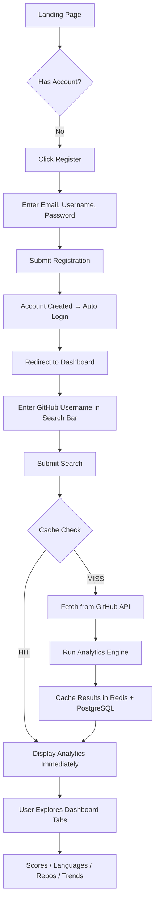
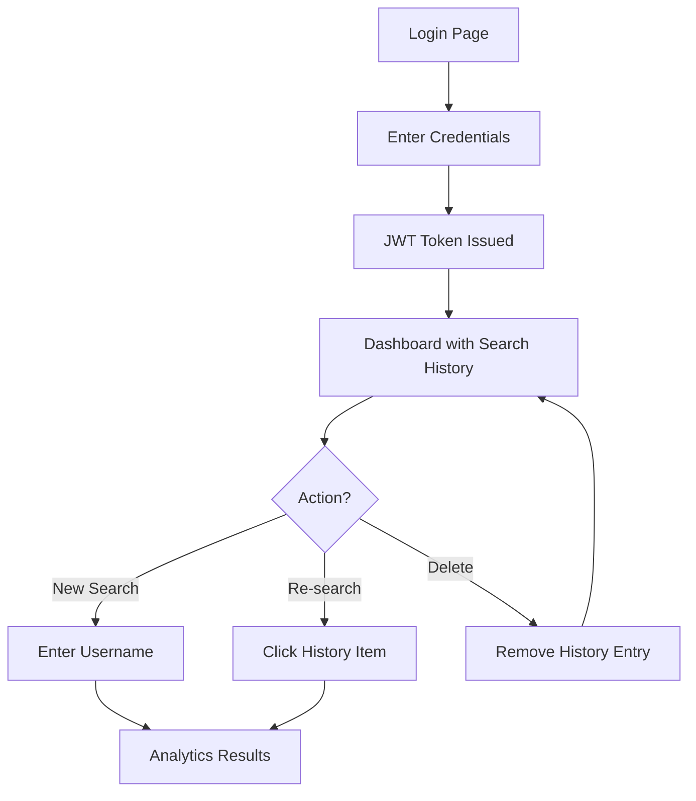
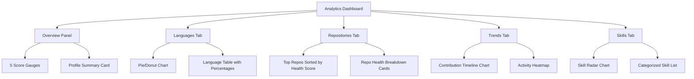

# 📋 Product Requirements Document (PRD)

## DevScope — GitHub Developer Intelligence Analyzer

**Version:** 1.0.0
**Last Updated:** May 2026
**Author:** DevScope Team
**Status:** Active Development

---

## Table of Contents

- [Product Overview](#product-overview)
- [Problem Statement](#problem-statement)
- [Why DevScope Matters](#why-devscope-matters)
- [Target Audience](#target-audience)
- [User Personas](#user-personas)
- [Product Goals](#product-goals)
- [User Flows](#user-flows)
- [Functional Requirements](#functional-requirements)
- [Non-Functional Requirements](#non-functional-requirements)
- [Success Metrics](#success-metrics)
- [Assumptions & Constraints](#assumptions--constraints)
- [Glossary](#glossary)

---

## Product Overview

**DevScope** is a full-stack web application that transforms raw GitHub data into actionable developer intelligence. Users enter a GitHub username and receive a comprehensive analytics dashboard featuring language distributions, skill assessments, repository health scores, contribution trends, and composite developer scores — all computed in real-time and beautifully visualized.

The application serves as both a **developer portfolio analyzer** and a **technical recruitment intelligence tool**, enabling anyone to quickly understand a developer's strengths, expertise domains, coding habits, and community engagement through data-driven insights derived entirely from their public GitHub activity.

### Product Vision

> *"Make every developer's public GitHub profile a rich, quantified, and visually compelling story — accessible to anyone in seconds."*

### Elevator Pitch

DevScope turns any GitHub username into a comprehensive intelligence report. In under 3 seconds, get language breakdowns, skill assessments, repository health audits, activity scores, and contribution trends — no setup, no integrations, just insights.

---

## Problem Statement

### The Gap

GitHub profiles contain a wealth of developer information — repositories, languages, activity patterns, community engagement, code quality signals — but this data is:

1. **Scattered** — spread across profile pages, repository lists, contribution graphs, and individual repo metadata
2. **Raw** — presented as unprocessed counts and lists without derived meaning
3. **Non-comparative** — no scoring, benchmarking, or trend analysis
4. **Visually sparse** — GitHub's default profile offers minimal visualization beyond the contribution heatmap
5. **Context-free** — individual data points lack composite scoring or natural-language interpretation

### Who Feels This Pain?

| Stakeholder | Pain Point |
|-------------|------------|
| **Recruiters** | Spend 15-30 min manually reviewing a candidate's GitHub to assess technical skills |
| **Hiring Managers** | Cannot quickly quantify or compare candidates' open-source activity |
| **Developers** | Lack a clear, scored understanding of their own GitHub presence |
| **Open Source Maintainers** | Difficulty evaluating new contributors' backgrounds |
| **Educators** | No tool to assess student developer growth over time |

### Current Alternatives & Their Limitations

| Tool | Limitation |
|------|-----------|
| GitHub Profile (native) | Raw data only, no scoring or analytics |
| GitHub Resume generators | Static PDF, no interactive visualizations |
| LinkedIn | Self-reported skills, no verified code analysis |
| CodersRank | Requires account linking, not instant lookup |
| GitStar Ranking | Stars-only metric, no holistic assessment |

---

## Why DevScope Matters

### For the Developer Ecosystem

1. **Democratizes developer assessment** — Anyone with a GitHub account has a quantified portfolio, not just those who build personal websites
2. **Promotes open-source contribution** — When contributions are measured and scored, developers are incentivized to contribute more and better
3. **Removes bias from hiring** — Data-driven skill assessment based on actual code, not pedigree or self-reported credentials
4. **Enables self-improvement** — Developers see exactly where they score low and can target improvements

### Technical Innovation

1. **Multi-tier caching architecture** — Demonstrates sophisticated Redis → PostgreSQL → GitHub API caching pipeline
2. **Real-time analytics engine** — Computes 5 distinct scoring dimensions from raw GitHub data
3. **Type-safe full-stack** — Shared TypeScript contracts ensure frontend-backend consistency at compile time
4. **Modern stack showcase** — Next.js 15, Express 5, and the latest in each technology layer

---

## Target Audience

### Primary Users

| Segment | Description | Usage Frequency |
|---------|-------------|-----------------|
| **Software Developers** | Analyzing their own or peers' GitHub profiles | Weekly |
| **Technical Recruiters** | Screening candidates' GitHub activity | Daily |
| **Hiring Managers** | Evaluating shortlisted candidates | Weekly |

### Secondary Users

| Segment | Description | Usage Frequency |
|---------|-------------|-----------------|
| **Open Source Maintainers** | Evaluating potential contributors | Ad hoc |
| **Coding Bootcamp Students** | Tracking their progress | Monthly |
| **Educators / Mentors** | Assessing student growth | Bi-weekly |
| **DevRel Professionals** | Identifying community contributors | Weekly |

---

## User Personas

### 👩‍💻 Persona 1: Priya — The Self-Improving Developer

| Attribute | Detail |
|-----------|--------|
| **Age** | 26 |
| **Role** | Mid-level Full-Stack Developer |
| **Location** | Bangalore, India |
| **Tech Stack** | React, Node.js, TypeScript, PostgreSQL |
| **GitHub Activity** | 200+ contributions/year, 15 public repos |
| **Goals** | Understand her developer strengths, identify skill gaps, prepare for senior promotion |
| **Frustrations** | GitHub's contribution graph tells her *how much* she codes, but not *how well* or *in what areas* |
| **DevScope Use Case** | Searches her own username weekly to track score improvements. Shares her DevScope analytics link in job applications as a quantified portfolio. |
| **Key Features Used** | Developer scores, skill assessment, contribution trends, language distribution |
| **Quote** | *"I want a data-driven answer to 'Am I ready for a senior role?' — not just gut feeling."* |

### 👨‍💼 Persona 2: Marcus — The Technical Recruiter

| Attribute | Detail |
|-----------|--------|
| **Age** | 34 |
| **Role** | Senior Technical Recruiter at a Series B startup |
| **Location** | Austin, Texas, USA |
| **Daily Volume** | Reviews 20-30 candidate profiles per day |
| **Goals** | Quickly assess candidate technical depth without deep code review. Filter out inflated resumes. |
| **Frustrations** | Manually clicking through each candidate's repos is time-consuming. Can't compare candidates objectively. |
| **DevScope Use Case** | Pastes candidate GitHub usernames to get instant analytics. Uses the overall score and skill breakdown to shortlist candidates. |
| **Key Features Used** | Overall developer score, top repositories, skill categories, repo health scores |
| **Quote** | *"I need to know if someone is actually a 'React expert' like their resume says — in 30 seconds, not 30 minutes."* |

### 🎓 Persona 3: Dr. Chen — The CS Professor

| Attribute | Detail |
|-----------|--------|
| **Age** | 45 |
| **Role** | Associate Professor of Computer Science |
| **Location** | Toronto, Canada |
| **Context** | Teaches software engineering courses with GitHub-based assignments |
| **Goals** | Track student development progress over a semester. Identify struggling students early. |
| **Frustrations** | GitHub Classroom shows submissions but not growth trajectories. No way to assess code quality at scale. |
| **DevScope Use Case** | Searches each student's GitHub username at the start and end of the semester to measure growth in activity scores and language breadth. |
| **Key Features Used** | Activity score trends, language distribution changes, contribution trends |
| **Quote** | *"I want to see which students are actually growing as developers, not just submitting assignments."* |

### 🛠️ Persona 4: Amara — The Open Source Maintainer

| Attribute | Detail |
|-----------|--------|
| **Age** | 31 |
| **Role** | Lead Maintainer of a popular npm package (5K+ stars) |
| **Location** | Lagos, Nigeria |
| **Context** | Receives 10-15 contribution PRs per week from new contributors |
| **Goals** | Quickly vet new contributors. Assign appropriate review levels based on experience. |
| **Frustrations** | No quick way to assess a new contributor's background. Has to manually review their profile and repos. |
| **DevScope Use Case** | When a new contributor opens a PR, searches their username to understand their experience level and primary languages. |
| **Key Features Used** | Skill assessment, repo health scores, activity and consistency scores |
| **Quote** | *"Before assigning a reviewer, I want to know: Is this a first-timer or an experienced systems programmer?"* |

---

## Product Goals

### Short-Term Goals (v1.0)

| ID | Goal | Success Criteria |
|----|------|------------------|
| G1 | Deliver instant GitHub analytics for any public profile | Search → full analytics in < 3 seconds (cached), < 8 seconds (uncached) |
| G2 | Compute meaningful developer scores | 5 scoring dimensions with transparent calculation methodology |
| G3 | Provide rich data visualizations | ≥ 6 distinct chart types displaying different data dimensions |
| G4 | Implement secure user authentication | JWT auth with refresh token rotation, bcrypt password hashing |
| G5 | Build multi-tier caching | Redis hot cache (1hr TTL) + PostgreSQL warm cache (24hr TTL) |
| G6 | Ensure responsive, accessible UI | WCAG 2.1 AA, fully functional from 320px to 2560px widths |

### Medium-Term Goals (v1.5)

| ID | Goal | Description |
|----|------|-------------|
| G7 | Side-by-side developer comparison | Compare 2-3 developers' analytics on a single view |
| G8 | Shareable analytics reports | Generate public links to share developer analytics |
| G9 | Weekly email digests | Opt-in weekly summary of tracked developers' changes |

### Long-Term Goals (v2.0)

| ID | Goal | Description |
|----|------|-------------|
| G10 | AI-powered insights | Natural language summaries using LLMs |
| G11 | Team analytics | Aggregate analytics across an organization's members |
| G12 | Trend prediction | ML-based prediction of developer trajectory |

---

## User Flows

### Flow 1: New User Registration → First Search

### Flow 2: Returning User → Search History

### Flow 3: Analytics Deep Dive

---

## Functional Requirements

### FR-1: User Authentication

| ID | Requirement | Priority |
|----|-------------|----------|
| FR-1.1 | Users can register with email, username, and password | P0 |
| FR-1.2 | Users can login with email and password | P0 |
| FR-1.3 | System issues JWT access tokens (15min) and refresh tokens (7 days) | P0 |
| FR-1.4 | Users can refresh expired access tokens using valid refresh tokens | P0 |
| FR-1.5 | Users can logout, invalidating their refresh token | P0 |
| FR-1.6 | Passwords are hashed with bcrypt (12 salt rounds) before storage | P0 |
| FR-1.7 | Users can retrieve their current profile via `/auth/me` | P1 |

### FR-2: GitHub Profile Search

| ID | Requirement | Priority |
|----|-------------|----------|
| FR-2.1 | Users can search for any GitHub user by exact username | P0 |
| FR-2.2 | Search results display user profile information (avatar, bio, stats) | P0 |
| FR-2.3 | Invalid usernames return a clear "User not found" error | P0 |
| FR-2.4 | Each search is recorded in the user's search history | P0 |
| FR-2.5 | Search results include a snapshot (name, avatar, repos, followers, score) | P1 |

### FR-3: Analytics Engine

| ID | Requirement | Priority |
|----|-------------|----------|
| FR-3.1 | System computes **Activity Score** (0-100) based on recent events, push frequency, and repo creation rate | P0 |
| FR-3.2 | System computes **Engagement Score** (0-100) based on followers, stars received, forks, and community interaction | P0 |
| FR-3.3 | System computes **Consistency Score** (0-100) based on contribution regularity and account longevity | P0 |
| FR-3.4 | System computes **Quality Score** (0-100) based on repo health (README, license, description, topics) | P0 |
| FR-3.5 | System computes **Overall Score** (0-100) as a weighted composite of all four dimension scores | P0 |
| FR-3.6 | System aggregates language usage across all repos by bytes and computes percentages | P0 |
| FR-3.7 | System maps languages and topics to categorized skills (language, framework, tool, domain, practice) | P0 |
| FR-3.8 | System evaluates each repo's health with 9 boolean/numeric criteria | P1 |
| FR-3.9 | System generates a natural-language summary of the developer profile | P1 |

### FR-4: Dashboard Visualizations

| ID | Requirement | Priority |
|----|-------------|----------|
| FR-4.1 | Display 5 score gauges/meters for each analytics dimension | P0 |
| FR-4.2 | Display a language distribution pie/donut chart with GitHub-accurate colors | P0 |
| FR-4.3 | Display a top repositories list sorted by health score | P0 |
| FR-4.4 | Display contribution trend line charts (commits, events over time) | P1 |
| FR-4.5 | Display a skill radar chart categorized by skill type | P1 |
| FR-4.6 | Display repo health score breakdown cards | P1 |

### FR-5: Search History

| ID | Requirement | Priority |
|----|-------------|----------|
| FR-5.1 | Authenticated users can view their search history (paginated) | P0 |
| FR-5.2 | Each history item shows the searched username, timestamp, and result snapshot | P0 |
| FR-5.3 | Users can delete individual search history items | P1 |
| FR-5.4 | Users can clear all search history | P1 |
| FR-5.5 | Clicking a history item re-runs the search with fresh data | P1 |

### FR-6: Caching

| ID | Requirement | Priority |
|----|-------------|----------|
| FR-6.1 | GitHub API responses are cached in Redis with configurable TTLs | P0 |
| FR-6.2 | Cached profiles are persisted to PostgreSQL as warm-tier cache | P0 |
| FR-6.3 | Cache lookup order: Redis → PostgreSQL → GitHub API | P0 |
| FR-6.4 | Cache TTLs: Profile (1hr), Repos (30min), Languages (1hr), Events (10min), Analytics (1hr) | P0 |
| FR-6.5 | Cache misses trigger fresh fetches and update both cache tiers | P0 |

### FR-7: Theme System

| ID | Requirement | Priority |
|----|-------------|----------|
| FR-7.1 | Users can toggle between dark and light themes | P1 |
| FR-7.2 | Theme preference persists across sessions (localStorage) | P1 |
| FR-7.3 | System detects and applies the user's OS color scheme preference on first visit | P2 |

---

## Non-Functional Requirements

### Performance

| ID | Requirement | Target |
|----|-------------|--------|
| NFR-1.1 | Time to First Byte (TTFB) | < 200ms |
| NFR-1.2 | Cached search response time | < 500ms |
| NFR-1.3 | Uncached search response time (full GitHub fetch + compute) | < 8 seconds |
| NFR-1.4 | Frontend Largest Contentful Paint (LCP) | < 2.5 seconds |
| NFR-1.5 | Frontend Cumulative Layout Shift (CLS) | < 0.1 |
| NFR-1.6 | API throughput | ≥ 50 requests/second per server instance |

### Scalability

| ID | Requirement | Target |
|----|-------------|--------|
| NFR-2.1 | Horizontal backend scaling | Stateless API servers behind load balancer |
| NFR-2.2 | Database connection pooling | Prisma connection pool with configurable limits |
| NFR-2.3 | Redis cluster support | Compatible with Redis Cluster for horizontal scaling |

### Reliability

| ID | Requirement | Target |
|----|-------------|--------|
| NFR-3.1 | API uptime | 99.5% monthly |
| NFR-3.2 | Graceful degradation | If Redis is unavailable, fall back to PostgreSQL cache only |
| NFR-3.3 | Error recovery | All API errors return structured JSON with error codes |

### Security

| ID | Requirement | Target |
|----|-------------|--------|
| NFR-4.1 | Password storage | bcrypt with ≥ 12 salt rounds |
| NFR-4.2 | SQL injection prevention | Parameterized queries via Prisma ORM |
| NFR-4.3 | XSS prevention | React DOM escaping + Helmet security headers |
| NFR-4.4 | Rate limiting | 100 requests per 15-minute window per IP |
| NFR-4.5 | CORS | Whitelist-based origin restriction |
| NFR-4.6 | Input validation | All API inputs validated with Zod schemas |

### Accessibility

| ID | Requirement | Target |
|----|-------------|--------|
| NFR-5.1 | WCAG compliance level | AA (2.1) |
| NFR-5.2 | Keyboard navigation | All interactive elements focusable and operable |
| NFR-5.3 | Screen reader support | Semantic HTML + ARIA labels on dynamic content |
| NFR-5.4 | Color contrast ratio | ≥ 4.5:1 for normal text, ≥ 3:1 for large text |

---

## Success Metrics

### Quantitative KPIs

| Metric | Definition | Target (30 days post-launch) |
|--------|-----------|------------------------------|
| **Daily Active Users (DAU)** | Unique users performing ≥ 1 search/day | 100 |
| **Searches per User per Session** | Average searches performed in a single session | ≥ 2.5 |
| **Average Response Time** | Mean time from search submission to full dashboard render | < 3 seconds (cached) |
| **Cache Hit Rate** | Percentage of searches served from Redis or PostgreSQL cache | ≥ 60% |
| **Registration-to-First-Search** | Percentage of new registrations who complete their first search | ≥ 80% |
| **Error Rate** | Percentage of API requests resulting in 5xx errors | < 0.5% |
| **Uptime** | Monthly API availability | ≥ 99.5% |

### Qualitative Indicators

| Indicator | Measurement Method |
|-----------|-------------------|
| User satisfaction with analytics accuracy | In-app feedback form / NPS score |
| Design quality and polish | Fellowship evaluator feedback |
| Code quality and architecture | Code review by engineering assessors |
| Documentation completeness | Docs coverage of all features and decisions |

---

## Assumptions & Constraints

### Assumptions

1. Users have basic familiarity with GitHub and understand terms like "repository," "stars," and "forks"
2. The GitHub REST API v3 remains publicly accessible for unauthenticated requests (60/hr) and authenticated requests (5,000/hr)
3. Public GitHub data is a reasonable proxy for a developer's technical skills
4. Users accept that analytics are derived from *public* data only — private repos are excluded

### Constraints

1. **GitHub API rate limits** — Without a token: 60 req/hr. With token: 5,000 req/hr. Heavy usage requires caching.
2. **Public data only** — GitHub API does not expose private repository data for third parties
3. **Event history limit** — GitHub Events API returns only the most recent 300 events (up to 90 days)
4. **Budget** — Zero-cost deployment tier (Vercel free, Render free, Supabase free, Upstash free)
5. **No OAuth** — v1.0 uses username-password auth, not GitHub OAuth (planned for v1.5)

---

## Glossary

| Term | Definition |
|------|-----------|
| **Activity Score** | A 0-100 score measuring a developer's recent GitHub activity volume and frequency |
| **Engagement Score** | A 0-100 score measuring community interaction (followers, stars, forks received) |
| **Consistency Score** | A 0-100 score measuring the regularity and longevity of GitHub contributions |
| **Quality Score** | A 0-100 score measuring repository best practices (README, license, docs) |
| **Overall Score** | A 0-100 weighted composite of all four dimension scores |
| **Repo Health Score** | A per-repository 0-100 score based on 9 criteria (README, license, activity, etc.) |
| **Cache TTL** | Time-To-Live: how long a cached value remains valid before requiring a fresh fetch |
| **Hot Cache** | Redis — fast in-memory cache with short TTL (minutes to hours) |
| **Warm Cache** | PostgreSQL — persistent cache with longer TTL (hours to days) |
| **Cold Source** | GitHub API — the authoritative data source, fetched on cache miss |

---

*This PRD is a living document. Updates will be versioned and tracked via Git history.*
