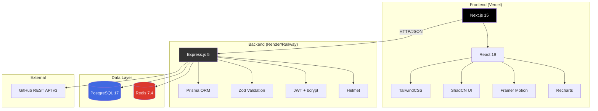

# 🛠️ Technology Stack

## DevScope — Technology Choices & Rationale

---

## Table of Contents

- [Stack Overview](#stack-overview)
- [Frontend Technologies](#frontend-technologies)
- [Backend Technologies](#backend-technologies)
- [Database & Caching](#database--caching)
- [DevOps & Tooling](#devops--tooling)
- [Shared Infrastructure](#shared-infrastructure)
- [Scalability Strategy](#scalability-strategy)

---

## Stack Overview



| Layer | Technology | Version | Role |
|-------|-----------|---------|------|
| **Frontend Framework** | Next.js | 15 | React meta-framework with App Router |
| **UI Library** | React | 19 | Component rendering |
| **Language** | TypeScript | 5.7+ | Type safety across full stack |
| **Styling** | TailwindCSS | 3.4+ | Utility-first CSS |
| **Components** | ShadCN UI | Latest | Accessible component primitives |
| **Animation** | Framer Motion | 11+ | Declarative motion library |
| **Charts** | Recharts | 2.x | React-native charting |
| **Backend Framework** | Express.js | 5 | HTTP server + routing |
| **ORM** | Prisma | 5.x+ | Type-safe database access |
| **Validation** | Zod | 3.x | Runtime type validation |
| **Auth** | JSON Web Tokens | — | Stateless authentication |
| **Hashing** | bcrypt | 5.x | Password hashing |
| **Security** | Helmet | 7.x | HTTP security headers |
| **Database** | PostgreSQL | 17 | Primary data store |
| **Cache** | Redis | 7.4 | In-memory caching layer |
| **Containers** | Docker Compose | — | Local infrastructure |

---

## Frontend Technologies

### Next.js 15

**Role:** React meta-framework powering the entire frontend application.

#### Why Next.js 15?

| Reason | Detail |
|--------|--------|
| **App Router** | File-system based routing with nested layouts, loading states, and error boundaries built-in |
| **Server Components** | Reduced client-side JavaScript bundle by rendering static parts on the server |
| **Streaming** | Progressive rendering with `loading.tsx` and React Suspense for instant feedback |
| **Built-in optimization** | Automatic image optimization, font optimization, code splitting |
| **Vercel deployment** | Zero-config production deployment with edge CDN |
| **TypeScript first** | Native TypeScript support with automatic type generation for routes |

#### Alternatives Considered

| Alternative | Why Not Chosen |
|-------------|---------------|
| **Vite + React** | No SSR, no file-system routing, no built-in optimization. Would need React Router, manual code-splitting. |
| **Remix** | Excellent framework, but smaller ecosystem and less deployment flexibility than Next.js. |
| **Astro** | Optimized for content sites, not data-heavy SPA-like dashboards. |
| **Angular** | Heavier framework, steeper learning curve, less relevant to modern React ecosystem. |

#### Scalability Considerations

- **ISR (Incremental Static Regeneration)** — Could pre-render popular developer profiles at build time
- **Edge Runtime** — Middleware runs at the edge for global low-latency routing
- **Turbopack** — Next.js 15's Rust-based bundler for faster dev builds at scale
- **Route Handlers** — API routes within Next.js for lightweight BFF patterns if backend is eliminated

---

### TypeScript (5.7+)

**Role:** Shared language across frontend, backend, and shared packages.

#### Why TypeScript?

| Reason | Detail |
|--------|--------|
| **Type safety** | Catch bugs at compile time, not runtime — especially critical for API contracts |
| **IntelliSense** | Superior IDE experience with autocompletion, refactoring, and inline documentation |
| **Shared types** | The `@devscope/shared` package ensures frontend and backend agree on data shapes |
| **Industry standard** | Expected in any modern full-stack project; demonstrates professional engineering |
| **Gradual adoption** | `strict: true` mode enforced — no implicit `any`, no unchecked indexed access |

#### Configuration Highlights

```json
{
  "compilerOptions": {
    "target": "ESNext",
    "module": "NodeNext",
    "strict": true,
    "noImplicitReturns": true,
    "noFallthroughCasesInSwitch": true,
    "noUncheckedIndexedAccess": true
  }
}
```

Key strict flags:
- `strict: true` — enables all strict type-checking options
- `noUncheckedIndexedAccess: true` — array/object indexing returns `T | undefined`, preventing runtime errors
- `noImplicitReturns: true` — every code path must explicitly return

---

### TailwindCSS (3.4+)

**Role:** Utility-first CSS framework for all styling.

#### Why TailwindCSS?

| Reason | Detail |
|--------|--------|
| **Speed** | Inline utilities eliminate context-switching between HTML and CSS files |
| **Consistency** | Predefined spacing, color, and sizing scales enforce design consistency |
| **Bundle size** | Tree-shaking removes unused styles — production CSS is typically < 10KB |
| **Dark mode** | Built-in `dark:` variant with class-based toggling |
| **Responsive** | Mobile-first responsive prefixes (`sm:`, `md:`, `lg:`, `xl:`) |
| **Customization** | Extensible via `tailwind.config.ts` with custom colors, fonts, and breakpoints |

#### Alternatives Considered

| Alternative | Why Not Chosen |
|-------------|---------------|
| **CSS Modules** | More boilerplate, no design system enforcement, harder to maintain consistency |
| **Styled Components** | Runtime CSS-in-JS adds bundle weight and SSR complexity |
| **Vanilla Extract** | Good approach but adds build complexity; smaller community |

---

### ShadCN UI

**Role:** Accessible, customizable component primitives.

#### Why ShadCN UI?

| Reason | Detail |
|--------|--------|
| **Ownership** | Components are copied into your codebase, not installed as a dependency — full control |
| **Accessibility** | Built on Radix UI primitives with full ARIA compliance |
| **Tailwind-native** | Styled with Tailwind CSS custom properties — seamless integration |
| **Customizable** | Override any style, add variants, extend components without forking a library |
| **No version lock** | Since it's your code, no breaking updates from library maintainers |

#### Alternatives Considered

| Alternative | Why Not Chosen |
|-------------|---------------|
| **Material UI (MUI)** | Opinionated design system, heavy bundle, hard to customize deeply |
| **Chakra UI** | Good DX but runtime CSS-in-JS, less performant than Tailwind |
| **Ant Design** | Enterprise-focused, large bundle, Chinese documentation primary |
| **Headless UI** | Good primitives but fewer pre-built components than ShadCN |

---

### Framer Motion (11+)

**Role:** Declarative animation library for React.

#### Why Framer Motion?

| Reason | Detail |
|--------|--------|
| **Declarative** | Animate with props (`initial`, `animate`, `exit`) not imperative callbacks |
| **Layout animations** | Automatic layout transitions when elements change position/size |
| **Gesture support** | `whileHover`, `whileTap`, `whileDrag` for interactive animations |
| **Exit animations** | `AnimatePresence` enables smooth unmount animations (not possible with CSS alone) |
| **Physics-based** | Spring animations that feel naturally physical |
| **Reduced motion** | Built-in `prefers-reduced-motion` support |

#### Alternatives Considered

| Alternative | Why Not Chosen |
|-------------|---------------|
| **CSS Transitions** | No exit animations, no layout animations, no spring physics |
| **React Spring** | Similar capability but less intuitive API, smaller community |
| **GSAP** | Imperative approach, overkill for UI animations, commercial license |
| **Auto Animate** | Too simple for the animation complexity needed |

---

### Recharts (2.x)

**Role:** React-native charting library for data visualizations.

#### Why Recharts?

| Reason | Detail |
|--------|--------|
| **React-native** | Declarative JSX components (`<PieChart>`, `<BarChart>`, `<LineChart>`) |
| **Composable** | Mix and match chart elements (axes, legends, tooltips, reference lines) |
| **Responsive** | `<ResponsiveContainer>` handles resize automatically |
| **Customizable** | Custom shapes, labels, tooltips via render props |
| **Lightweight** | Smaller than many alternatives, tree-shakeable |
| **SVG-based** | Renders crisp at any resolution, styleable with CSS |

#### Alternatives Considered

| Alternative | Why Not Chosen |
|-------------|---------------|
| **D3.js** | Too low-level, requires imperative DOM manipulation |
| **Chart.js** | Canvas-based (not SVG), harder to customize, React wrapper is secondary |
| **Nivo** | Beautiful defaults but heavier bundle, less composition flexibility |
| **Victory** | Good alternative but smaller community and fewer chart types |
| **Visx (Airbnb)** | Very low-level D3 primitives for React, too much boilerplate |

---

## Backend Technologies

### Express.js 5

**Role:** HTTP server and API routing framework.

#### Why Express.js 5?

| Reason | Detail |
|--------|--------|
| **Maturity** | Most battle-tested Node.js framework, massive ecosystem |
| **Simplicity** | Minimalist core — add only what you need via middleware |
| **Flexibility** | No opinions on project structure — fits our layered architecture |
| **Middleware ecosystem** | cors, helmet, express-rate-limit, cookie-parser — plug-and-play |
| **Version 5** | Promise-based error handling, improved routing, modern Node.js features |
| **Community** | Enormous community, extensive documentation, easy to find solutions |

#### Alternatives Considered

| Alternative | Why Not Chosen |
|-------------|---------------|
| **Fastify** | Faster, but less middleware ecosystem; learning curve for team |
| **Hono** | Edge-native, very fast, but very new; smaller ecosystem |
| **NestJS** | Too opinionated (Angular-style DI); overkill for this API surface |
| **Koa** | Lighter than Express but smaller community, less middleware |
| **tRPC** | Excellent for Next.js monoliths, but we want a decoupled API server |

#### Scalability Considerations

- **Stateless design** — No in-memory state; all state in PostgreSQL/Redis. Enables horizontal scaling.
- **Cluster mode** — Can run with `node:cluster` or PM2 for multi-process on a single server
- **Load balancing** — Compatible with any reverse proxy (Nginx, Caddy, cloud LB)
- **Microservice extraction** — Individual route groups can be extracted into standalone services if needed

---

### Prisma ORM (5.x+)

**Role:** Type-safe database access and schema management.

#### Why Prisma?

| Reason | Detail |
|--------|--------|
| **Type generation** | Auto-generates TypeScript types from schema — queries are fully typed |
| **Migration system** | `prisma migrate` manages schema changes with version-controlled SQL |
| **Query builder** | Intuitive, chainable queries: `prisma.user.findUnique({ where: { id } })` |
| **Relations** | Handles joins, nested includes, and relation queries declaratively |
| **SQL injection prevention** | All queries are parameterized by default |
| **Studio** | `prisma studio` provides a visual database browser for development |

#### Alternatives Considered

| Alternative | Why Not Chosen |
|-------------|---------------|
| **Drizzle ORM** | Lighter, SQL-closer, but less mature migration tooling |
| **TypeORM** | Decorator-heavy, less TypeScript-native, more bugs in practice |
| **Knex.js** | Query builder only, no schema management or type generation |
| **Raw SQL** | Maximum control but no type safety, migration management, or injection protection |

---

### Zod (3.x)

**Role:** Runtime type validation for API inputs.

#### Why Zod?

| Reason | Detail |
|--------|--------|
| **TypeScript-first** | Schemas infer TypeScript types automatically: `z.infer<typeof schema>` |
| **Composable** | Combine, extend, and transform schemas with `.merge()`, `.extend()`, `.transform()` |
| **Descriptive errors** | Rich error messages with field paths and custom messages |
| **Small** | ~13KB gzipped, no dependencies |
| **Framework agnostic** | Works in frontend (form validation) and backend (API validation) |

#### Example Usage

```typescript
const searchSchema = z.object({
  username: z.string()
    .min(1, 'Username is required')
    .max(39, 'GitHub usernames are max 39 characters')
    .regex(/^[a-zA-Z0-9](?:[a-zA-Z0-9]|-(?=[a-zA-Z0-9])){0,38}$/, 'Invalid GitHub username format'),
});
```

---

### JWT (JSON Web Tokens)

**Role:** Stateless authentication mechanism.

#### Why JWT?

| Reason | Detail |
|--------|--------|
| **Stateless** | Server doesn't need to query a session store on every request |
| **Horizontal scaling** | Any server instance can verify a token without shared state |
| **Standard** | RFC 7519, widely supported across languages and frameworks |
| **Payload** | Embed user info (id, email) in the token to avoid DB lookups |
| **Expiration** | Built-in `exp` claim for automatic token expiry |

#### Security Mitigations

| Concern | Mitigation |
|---------|-----------|
| Token theft | Short-lived access tokens (15min) + refresh token rotation |
| Token storage | Access token in memory, refresh token in HttpOnly cookie |
| Token invalidation | Refresh tokens stored in DB, deletable on logout |

---

## Database & Caching

### PostgreSQL 17

**Role:** Primary persistent data store.

#### Why PostgreSQL?

| Reason | Detail |
|--------|--------|
| **ACID compliance** | Full transactional integrity for user data and search history |
| **JSONB** | Native JSON storage for flexible `result_snapshot` fields |
| **Indexing** | B-tree, GIN, and partial indexes for optimal query performance |
| **Prisma support** | First-class Prisma integration with full feature support |
| **Managed options** | Supabase, Neon, and AWS RDS all offer free/cheap managed PostgreSQL |
| **Extensibility** | Extensions (pg_trgm for fuzzy search, pg_stat for monitoring) |

#### Alternatives Considered

| Alternative | Why Not Chosen |
|-------------|---------------|
| **MySQL** | Less feature-rich (no native JSONB, weaker indexing) |
| **MongoDB** | Document model adds complexity without benefit for structured data; less ACID |
| **SQLite** | Single-file, no concurrent writes, not suitable for production server |
| **CockroachDB** | Overkill for v1, adds distributed complexity |

---

### Redis 7.4

**Role:** In-memory cache (hot tier) and session store.

#### Why Redis?

| Reason | Detail |
|--------|--------|
| **Speed** | Sub-millisecond reads — perfect for cache hit latency |
| **TTL support** | Native key expiration for cache invalidation |
| **Data structures** | Strings, hashes, sorted sets — flexible cache patterns |
| **Persistence** | Optional RDB/AOF persistence for cache warmth across restarts |
| **Managed options** | Upstash (serverless), Redis Cloud, AWS ElastiCache |
| **Pub/Sub** | Potential for real-time features (notifications, live updates) |

#### Alternatives Considered

| Alternative | Why Not Chosen |
|-------------|---------------|
| **Memcached** | Simpler but no persistence, no data structures, no TTL per-key |
| **In-memory Map** | Lost on restart, not shared across server instances |
| **Upstash only** | Serverless Redis; good for production but doesn't replace local dev Docker |

---

## DevOps & Tooling

### Docker Compose

**Role:** Local development infrastructure (PostgreSQL + Redis).

#### Configuration

```yaml
services:
  postgres:
    image: postgres:17-alpine    # Alpine for smaller image
    ports: ["5432:5432"]
    healthcheck:                 # Ensures DB is ready before app connects
      test: ["CMD-SHELL", "pg_isready"]
  redis:
    image: redis:7.4-alpine
    command: redis-server --requirepass ${REDIS_PASSWORD}
    ports: ["6379:6379"]
```

#### Why Docker Compose?

- **Reproducible** — Every developer gets identical PostgreSQL and Redis versions
- **Isolated** — No conflicts with other projects' databases
- **One command** — `docker compose up -d` starts everything
- **Data persistence** — Named volumes survive container restarts

---

### ESLint + Prettier

**Role:** Code quality and formatting enforcement.

| Tool | Purpose | Configuration |
|------|---------|---------------|
| ESLint | Catch code issues, enforce patterns | `@typescript-eslint/recommended`, `next/core-web-vitals` |
| Prettier | Consistent code formatting | `semi: true`, `singleQuote: true`, `tabWidth: 2`, `trailingComma: 'all'` |

---

## Shared Infrastructure

### @devscope/shared Package

**Role:** Single source of truth for TypeScript types and constants shared between frontend and backend.

#### Contents

| File | Purpose |
|------|---------|
| `types/github.ts` | GitHub API response interfaces (`GitHubUser`, `GitHubRepo`, `GitHubEvent`, `GitHubLanguages`) |
| `types/api.ts` | API contract types (`ApiResponse<T>`, `ApiError`, `PaginatedResponse<T>`, auth types) |
| `types/analytics.ts` | Analytics types (`DeveloperAnalytics`, `DeveloperScores`, `LanguageDistribution`, etc.) |
| `constants/index.ts` | Language colors, skill mappings, topic-skill mappings, score labels, cache TTLs, rate limits |

#### Benefits

1. **Single source of truth** — Change a type once, both apps update
2. **Compile-time safety** — Frontend can't send data the backend doesn't expect
3. **Refactoring confidence** — Rename a field and TypeScript catches all usages
4. **Documentation** — Types serve as living API documentation

---

## Scalability Strategy

### Current Architecture (v1.0)

```
Single Frontend (Vercel) → Single Backend (Render) → Single PostgreSQL → Single Redis
```

### Growth Architecture (v1.5)

```
Frontend CDN (Vercel Edge) → 2-3 Backend Instances (Load Balanced)
                           → PostgreSQL with Read Replica
                           → Redis Cluster (3 nodes)
```

### Future Architecture (v2.0)

```
Frontend CDN (Vercel Edge) → API Gateway → Microservices:
                                            ├── Auth Service
                                            ├── GitHub Service
                                            ├── Analytics Service
                                            └── Notification Service
                           → PostgreSQL Cluster (Primary + Replicas)
                           → Redis Cluster (Sentinel)
                           → Message Queue (BullMQ/RabbitMQ)
```

### Scaling Bottleneck Analysis

| Component | Bottleneck | Solution |
|-----------|-----------|----------|
| Backend API | CPU-bound analytics computation | Horizontal scaling (more instances) |
| PostgreSQL | Write throughput | Connection pooling (PgBouncer), read replicas |
| Redis | Memory capacity | Redis Cluster with data sharding |
| GitHub API | Rate limits (5,000/hr) | Aggressive caching, multiple API tokens |
| Frontend | Bundle size | Code splitting, lazy loading, edge caching |

---

*This tech stack document justifies every technology choice with rationale, alternatives considered, and scaling strategies. It serves as both a decision record and a guide for future contributors.*
